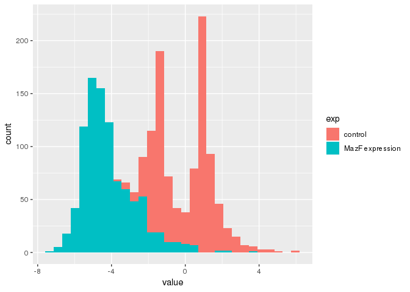

MazF mass spec data example
================

``` r
library(tidyverse)
```

    ## ── Attaching packages ───────────────────────────────────────────────────────────────────────────────────────────────── tidyverse 1.2.1 ──

    ## ✔ ggplot2 3.0.0     ✔ purrr   0.2.5
    ## ✔ tibble  1.4.2     ✔ dplyr   0.7.6
    ## ✔ tidyr   0.8.1     ✔ stringr 1.3.1
    ## ✔ readr   1.1.1     ✔ forcats 0.3.0

    ## ── Conflicts ──────────────────────────────────────────────────────────────────────────────────────────────────── tidyverse_conflicts() ──
    ## ✖ dplyr::filter() masks stats::filter()
    ## ✖ dplyr::lag()    masks stats::lag()

``` r
library(reshape2)
```

    ## 
    ## Attaching package: 'reshape2'

    ## The following object is masked from 'package:tidyr':
    ## 
    ##     smiths

``` r
library(skimr)
```

``` r
d <- read_delim("forboxplot.csv", delim = ";")
```

    ## Parsed with column specification:
    ## cols(
    ##   GENE = col_character(),
    ##   ` control 20 min` = col_double(),
    ##   `MazF 20 min` = col_double(),
    ##   ` control 1h` = col_double(),
    ##   `MazF 1h` = col_double(),
    ##   `MazF regulon` = col_character()
    ## )

``` r
skim(d)
```

    ## Skim summary statistics
    ##  n obs: 467 
    ##  n variables: 6 
    ## 
    ## ── Variable type:character ───────────────────────────────────────────────────────────────────────────────────────────────────────────────
    ##      variable missing complete   n min max empty n_unique
    ##          GENE       0      467 467   3   9     0      467
    ##  MazF regulon       0      467 467   2   3     0        2
    ## 
    ## ── Variable type:numeric ─────────────────────────────────────────────────────────────────────────────────────────────────────────────────
    ##         variable missing complete   n  mean   sd    p0   p25   p50   p75
    ##       control 1h       0      467 467  1.19 0.79 -0.61  0.79  0.97  1.41
    ##   control 20 min       0      467 467 -1.2  1.07 -3.68 -1.69 -1.45 -0.95
    ##          MazF 1h       0      467 467 -4.11 1.49 -6.8  -5.11 -4.47 -3.38
    ##      MazF 20 min       0      467 467 -4.17 1.43 -7.16 -5.16 -4.51 -3.45
    ##  p100     hist
    ##  6.17 ▁▇▅▁▁▁▁▁
    ##  5.02 ▁▇▇▂▁▁▁▁
    ##  3.62 ▂▇▃▂▁▁▁▁
    ##  2.08 ▁▇▇▃▂▁▁▁

``` r
d_long <- melt(d)
```

    ## Using GENE, MazF regulon as id variables

``` r
d_long$variable <- d_long$variable %>%  str_trim(side = "both")
```

``` r
d_long1 <- d_long %>% separate(variable, c("exp", "time", "min"), sep = " ")
```

    ## Warning: Expected 3 pieces. Missing pieces filled with `NA` in 934 rows
    ## [935, 936, 937, 938, 939, 940, 941, 942, 943, 944, 945, 946, 947, 948, 949,
    ## 950, 951, 952, 953, 954, ...].

``` r
d_long1$time <- str_replace_all(d_long1$time, "h", "")
d_long1$time <- str_replace_all(d_long1$time, "1", "60")
d_long1$time <- as.numeric(d_long1$time)
```

``` r
d_long1$`MazF regulon` <- d_long1$`MazF regulon` %>% str_replace_all("yes", "MazF regulon")
d_long1$`MazF regulon` <- d_long1$`MazF regulon` %>% str_replace_all("no", "other proteins")
```

``` r
d_long1$exp <- d_long1$exp %>% str_replace_all("MazF", "MazF expression")
```

``` r
d_long1 <- d_long1 %>% select(-min)
```

facet\_wrap() facet\_grid()

``` r
ggplot(d_long1, aes(x = value, fill = exp)) +
  geom_histogram(bins = 30)
```


